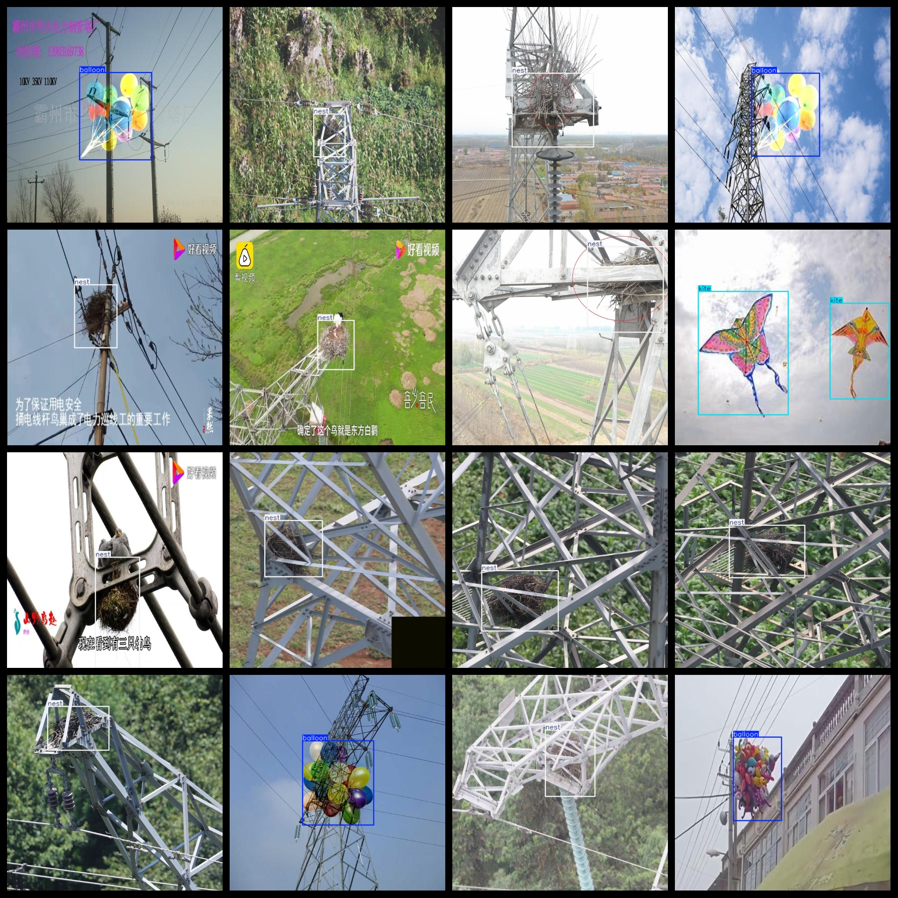

# Transmission Line Foreign Object Detection Dataset 725 imagesVOC+YOLO format

The Transmission Line Foreign Object Detection Dataset consists of 725 images in the VOC+YOLO format.

Dataset format: Pascal VOC format + YOLO format (excluding split paths in txt files, only including jpg images along with corresponding VOC format xml files and YOLO format txt files).

Number of images (jpg file count): 725

Number of annotations (xml file count): 725

Number of annotations (txt file count): 725

Number of annotation categories: 4

Repository location: datasets_sl

Annotation category names according to the labels folder's classes.txt file: ["balloon", "kite", "nest", "trash"]

Box counts for each category:

- balloon box count = 83
- kite box count = 99
- nest box count = 475
- trash box count = 76
Total box count: 733

Image counts per category:

- balloon image count = 83
- kite image count = 94
- nest image count = 472
- trash image count = 76

Image resolution: 640x640

Annotation tool used: labelImg

Dataset enhancement status: No

Annotation rules: Draw a rectangle around the category

Important note: The dataset does not have been split into training, validation, and test sets; you need to do that yourself.

Special declaration: This dataset does not guarantee any accuracy for models trained on it or the weight files.

## Images

---

Here is a pay link on Stripe (https://buy.stripe.com/3cs8yP7sY87d0vu9AB). Please contact me lonlonago@foxmail.com after funding $89, and I will send you a complete data files, thank you!

